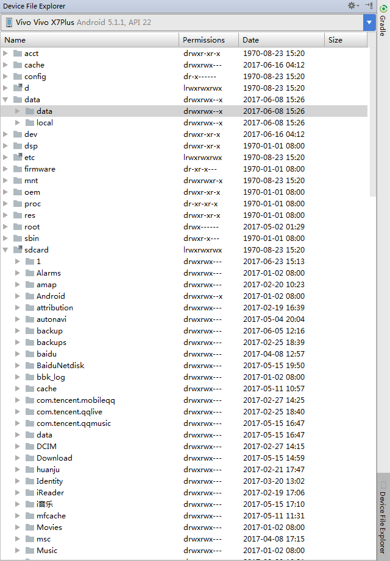
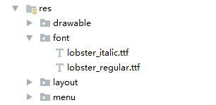
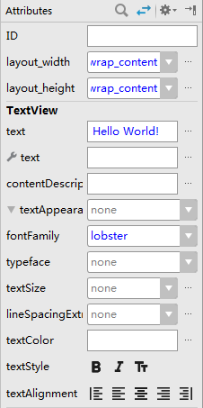
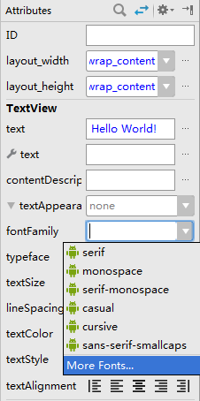
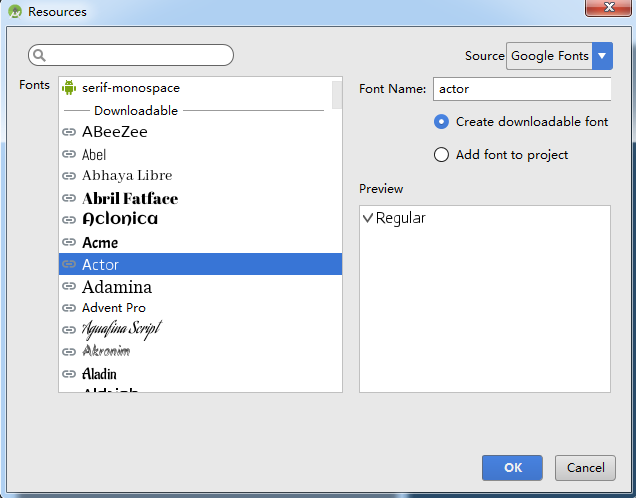

+++
date = "2017-07-09T15:13:05+08:00"
title = "Android Studio 3.0 Device File Explorer & Fonts"
draft = false
tags = ["Android Studio"]
categories = [ "Post" ]
+++

## Device File Explorer
使用设备的文件系统，可按如下的操作方式：

1. 点击**View > Tool Windows > Device File Explorer**或者点击右下角位于工具窗口条中的**Device File Explorer**按钮来打开Device File Explorer。

2. 从上方的下拉列表中选择设备。

3. 在文件浏览窗口中操作设备文件。鼠标右键点击文件或目录来创建一个新文件或目录，保存现在的文件或目录到电脑中，上传、删除或同步文件。鼠标双击文件可以在Android Studio中打开文件。

>**注意**：Android Studio 将用 Device File Explorer 打开的文件保存在工程外的临时目录中，如果在 Device File Explorer 中修改文件，并想把修改保存到设备中，需要手动将修改的文件上传到设备中。

  
**Figure1** Device File Explorer窗口

当浏览设备文件时，以下2个目录是经常访问的：

**data/data/app_name/**：包含存储于内部存储空间的应用数据文件

**sdcard/**：包含存储于外部存储空间的用户文件

>**注意**：不是所有的文件都在Device File Explorer中可见。例如在**data/data/**目录中，非debuggable应用的文件是不能展开的。

## XML Fonts & Downloadable Fonts
Android O 引入了XML字体新特性，可以将字体作为资源使用。

### XML Fonts
Android O 可以通过将字体文件加入**res/font**目录来将字体作为资源使用。这些字体会被编译到R文件中，并在 Android Studio 中可用。可以通过新的资源类型**font**来访问字体资源，例如用`@font/myfont`或者`R.font.myfont`来访问一个字体资源。

在 Android Studio 中可以通过执行以下步骤来字体资源：

1. 鼠标右键点击**res**目录，选择**New > Android Resource Directory**，打开**New Resource Directory**窗口。

2. 在**Resource type**列表里选择**font**，然后点击**OK**。  
  
**Figure2** 添加字体目录

3. 添加字体文件到**font**目录中。  
  
**Figure3** 添加字体文件到资源目录

4. 双击字体文件预览字体。  
  
**Figure4** 预览字体文件

#### 创建 font family
font family 是一个包含多个字体文件以及它们的style和weight信息的xml文件，font family 可以作为一个单元来访问。

通过以下步骤在 Android Studio 中创建一个 font family：

1. 鼠标右键点击**font**目录，选择**New > Font resource file**，打开**New Resource File**窗口。

2. 输入文件名，然后点击**OK**，一个新的字体资源xml文件将被打开在编辑器中。

3. 给`<font>`元素加入字体文件、style和weight等属性。下面是添加了字体相关属性后的字体资源xml的例子：
```xml
<?xml version="1.0" encoding="utf-8"?>
<font-family xmlns:android="http://schemas.android.com/apk/res/android">
    <font
        android:fontStyle="normal"
        android:fontWeight="400"
        android:font="@font/lobster_regular" />
    <font
        android:fontStyle="italic"
        android:fontWeight="400"
        android:font="@font/lobster_italic" />
</font-family>
```

#### 在 xml layouts 中使用字体
可以通过`fontFamily`属性将单个字体文件或 font family 中的字体绑定到`TextView`。

>**注意**：当使用 font family 时，`TextView`将自动根据需要从 font family 中选择字体文件。

给`TextView`设置字体可以用如下任一方式：

* 打开 layout xml 文件，给`fontFamily`属性设置字体文件。
```xml
<TextView
        android:layout_width="wrap_content"
        android:layout_height="wrap_content"
        android:fontFamily="@font/lobster"/>
```

* 在 layout 文件的 design 编辑器中选择`TextView`打开属性窗口，展开`textAppearance`属性，从`fontFamily`列表中选择字体。  
  
**Figure5** 在属性窗口中选择字体

### Downloadable fonts
Android O 和 Android Support Library 26 引入了从`provider`请求字体的api，从而不需要集成字体文件到apk或者让apk下载字体文件。

使用 Downloadable Fonts 特性三种方式：

* 通过 Android Studio 和 Google Play Service

* 通过编码实现

* 通过 support library

#### 通过 Android Studio 和 Google Play Services 使用 Downloadable Fonts
在 Android Studio 3.0 中，可以使用 Google Play Services 的 font provider 来给应用设置下载字体。

>**注意**：使用 Google Fonts Provider 要求设备中的 Google Play Services 版本大于等于11。

1. 在**Layout Editor**中选择一个`TextView`，在打开的属性窗口中选择**fontFamily > More Fonts**，打开**Resources**窗口。  
  
**Figure6** 使用 layout editor

2. 在**Source**下拉列表中选择**Google Fonts**。

3. 在**Fonts**列表中选择一个字体。

4. 选择**Create downloadable font**并点击**OK**。  
  
**Figure7** 从 Resources 窗口中选择字体

Android Studio 会自动生成相应的 xml 文件。  
  
**Figure8** 生成的字体 xml 文件

#### 其他使用 Downloadable Fonts 的方式
通过编码实现和通过 support library 的方式不涉及 Android Studio 本身，可参考链接：[Downloadable Fonts](https://developer.android.com/preview/features/downloadable-fonts.html)。

